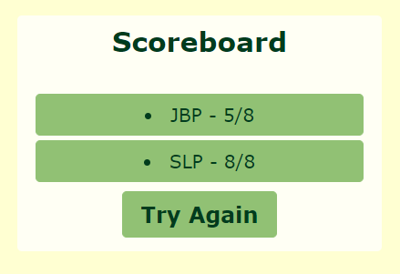

# Animal Kingdom Quiz

## Description

In this project, I worked to create a quiz with HTML, CSS, and JavaScript. I was motivated to provide a fun quiz about Disney’s Animal Kingdom park and have individual scores saved to local storage.

This website was created for the purpose of testing the knowledge of the Disney parks fan. I created a website where eight questions about Disney’s Animal Kingdom will be asked to ultimately receive a score out of eight.

Through the process of coding the Animal Kingdom Quiz, I was able to learn more about JSON and storing data as objects locally. I also had the opportunity to better acquaint myself with arrays, functions, variables, and for loops in JavaScript. The newest coding challenge that I was able to do repeatedly was calling the getElementById to create variables for buttons and containers. My biggest challenges, however, were to create elements, append stored JSON object information into the newly created elements, and to accurately store data as a JSON object array in the local storage.

[Here is a link to the webpage](https:/).

---
---

## Table of Contents

- [Animal Kingdom](#animal-kingdom)
- [Quiz](#quiz)
- [Credits](#credits)
- [License](#license)

---
---

## Animal Kingdom

Disney’s Animal Kingdom (DAK) is one of the four Walt Disney World parks. Though it has attractions and entertainment, DAK also has a drive for nature conservation and education. The park was designed intentionally to emulate various parts of the world and their culture. Walt Disney World is part of the Association of Zoos & Aquariums, so they have the opportunity to 
work with zoos around the world for species repopulation, animal rehabilitation, and education.

Though there are plenty of fun facts about DAK, I chose eight that would be both interesting and difficult. Please enjoy learning a little bit about this park through my short quiz.

---

## Quiz

### Start Quiz

Let’s start the quiz! The first and only thing you see when you open up the page is a “Start Quiz” button. This is where the fun begins!

### Question and Timer

Once the quiz has been started, each question (randomly selected from the eight available) will be presented one at a time. Along with the question, a 60 second timer will appear at the top left of the page. Try to answer the questions correctly, because each answer that is incorrect takes five seconds off the timer.

### Quiz Select

Scroll over your answers and the tan coloring will show which you’re selecting. Once you pick, the color will change to reveal the correct answer in dark green along with the incorrect answers in red and a next button will pop up to continue the quiz.

### Add Initials to Save

After you’ve moved through all the questions (or if your timer runs out), you’ll be prompted to add your initials and save your score. Here, the information is turned into a JSON object in an array and stored locally.

### All Done!

Now you’ve successfully walked through the eight question quiz! From here, you have the option to either try again immediately, or view the scoreboard.

### Scoreboard

Here is the scoreboard with the scores saved locally on my computer. My husband and I both tried the quiz, and these are our results!

---

## Credits

HTML Quiz walkthrough YouTube video by Simplilearn: https://youtu.be/lfjBJHN7vUo

Build A Quiz App With JavaScript YouTube video by Web Dev Simplified: https://youtu.be/riDzcEQbX6k

Simple Countdown Timer with JavaScript YouTube video by Florin Pop: https://youtu.be/x7WJEmxNlEs

Animal Kingdom information source: https://wdwnews.com/fact-sheets/2018/04/20/disneys-animal-kingdom-fun-facts/

My tutor, Corrado Alfano: calfano@bootcampspot.com

Helpful Resources:
W3 School’s information about JavaScript: https://www.w3schools.com/js/default.asp
Stack Overflow’s answered questions about JavaScript: https://stackoverflow.com/
MDN’s information on JavaScript: https://developer.mozilla.org/en-US/
Google.com helping me find the above resources
The Bootcamp gitLab DU-VIRT-FSF-PT-04-2023-U-LOLC repository

The README template I used was provided by The Full-Stack Blog: https://coding-boot-camp.github.io/full-stack/github/professional-readme-guide

---

## License
MIT Licence
